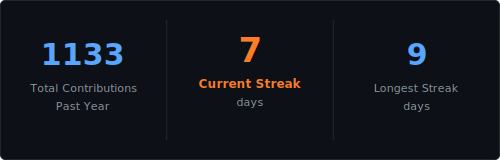
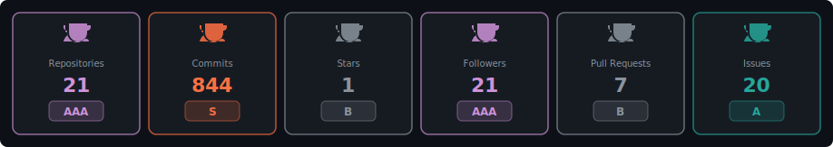

<div align="center">


</div>

<div align="center">

[+Information+Systems+Undergrad;IT+%26+Business+Explorer+🚀;Open+to+Collaborate+🤝;Building+ideas+into+reality+✨)](https://github.com/chamika-u)

</div>

---

## 👨‍💻 About Me

```yaml
name        : Chamika Udayanga
pronouns    : he / him
degree      : BSc. (Hons) Information Systems  [Undergraduate]
interests   : IT · Business · Software Development · Data · Innovation
goal        : Collaborate on impactful projects and turn ideas into products
fun_fact    : "I see something in myself. But I don't know what it is."
status      : Open to collaborations & opportunities 🟢
```

---

## 🛠️ Tech Stack & Skills

<div align="center">

### 💻 Languages


### 🚀 Frameworks & Libraries


### 🗄️ Databases & Cloud


### 🔧 Tools & Platforms


</div>

---

## 📊 GitHub Dashboard

<div align="center">




</div>

<div align="center">



</div>

<div align="center">


</div>

---

## 🏆 GitHub Trophies

<div align="center">



</div>

---

## 🎯 Focus Areas

<div align="center">

| 🖥️ Software Development | 📊 Information Systems | 💼 Business & Strategy |
|:---:|:---:|:---:|
| Building scalable web apps | Systems analysis & design | Tech-driven business solutions |

| 🤖 Emerging Technologies | 🎨 UI/UX Design | 🔐 Cybersecurity Basics |
|:---:|:---:|:---:|
| Exploring AI & automation | User-centered experiences | Secure system practices |

</div>

---

## 🤝 Let's Connect

<div align="center">

[](https://www.linkedin.com/in/chamika-u/)
[](https://github.com/chamika-u)

</div>

---

<div align="center">


### 💡 *"I see something in myself. But I don't know what it is."* ✨


</div>
